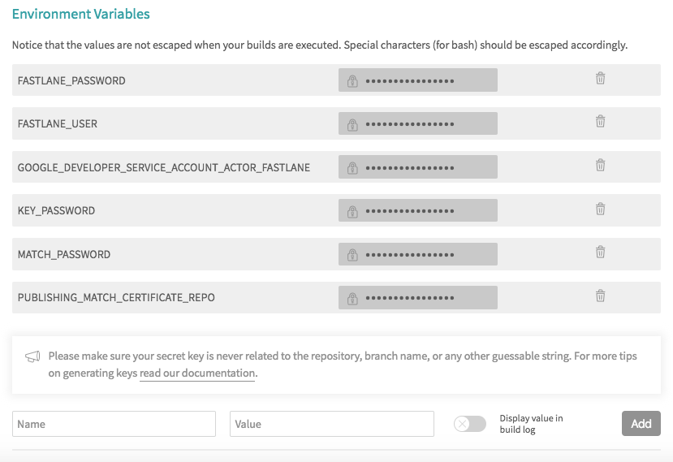
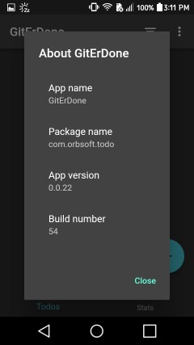
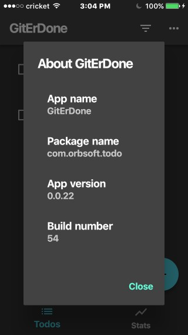
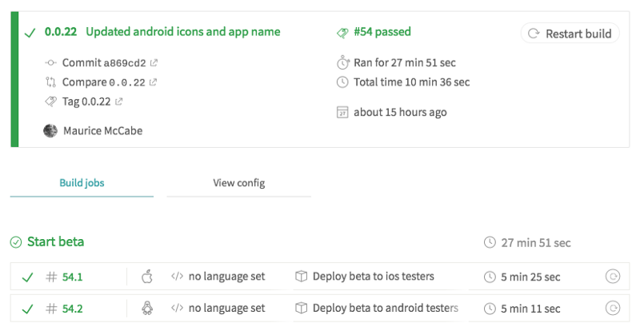

[](https://pub.dartlang.org/packages/fledge)


See [article](https://medium.com/@nocnoc/cicd-for-flutter-fdc07fe52abd) for introduction to Fledge.

# Fledge: A CICD tool for Flutter
Automatically build, test, sign and release your Flutter app to both Apple and Google stores. 

Supports public and private build servers in the cloud (Travis, Cirrus, etc...) and in-house (Jenkins, GitLab, etc...).

# Quick start
For example, with GitHub and Travis:

1. Install Fledge  
    ```
    $ pub global activate fledge
    ```

1. Add secrets  
    Set your secret variables in:  
    ```
    https://travis-ci.org/<your name>/<your repo>/settings
    ```
      
    These variables are used for signing and uploading to both stores.

1. Add app to Fledge  
    Install the Travis config file and Fastlane files
    ```bash
    $ fledge config -b travis
    ```

1. Start a beta  
    Run pipeline on Travis
    ```
    $ fledge beta
    ```
    This will build your app, upload to both store consoles and release to beta testers.

1. Release to users  
    ```
    $ fledge release
    ```
    This will release the app to users.

# Documentation

[View the documentation site](https://mmcc007.github.io/fledge/) for usage and configuration information.

# Demo
For a demo of Fledge in action see: https://github.com/mmcc007/todo. 

You can download the demo app, which is live on the Google and Apple stores, to your android or iOS device:

[](https://play.google.com/store/apps/details?id=com.orbsoft.todo)
[](https://itunes.apple.com/us/app/giterdone/id1450240301)
 
 and select the 'About' feature by tapping on the app title 'GitErDone'. 
 
 On an android device you will see:  
 
 
 On an iOS device you will see:  
 
 
 You can then trace this back to the actual pipeline that produced the build artifacts for the app on both device types here (click on image for link to actual build):  
 [](https://travis-ci.org/mmcc007/todo/builds/493633473)
 
# License

Fledge is distributed by an [MIT license](https://github.com/mmcc007/fledge/tree/master/LICENSE.txt).

# Contributing

When contributing to this repository, please feel free to discuss the change you wish to make via issue,
email, or any other method with the owners of this repository before making a change.

[Issues](https://github.com/mmcc007/screenshots/issues) and [pull requests](https://github.com/mmcc007/screenshots/pulls) are welcome.

# Code of Conduct

Fledge is committed to fostering a welcoming community.